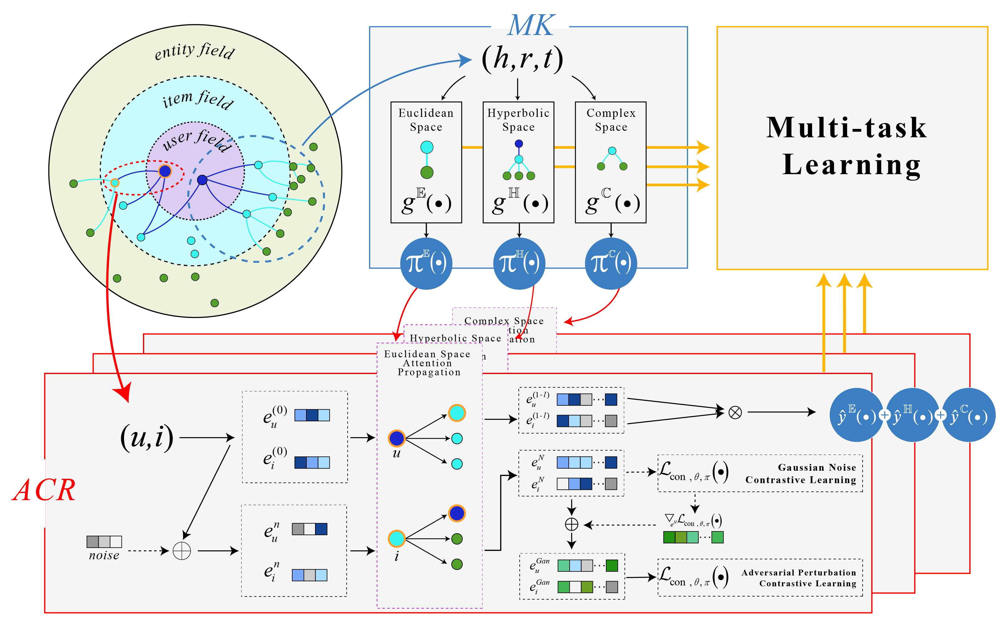
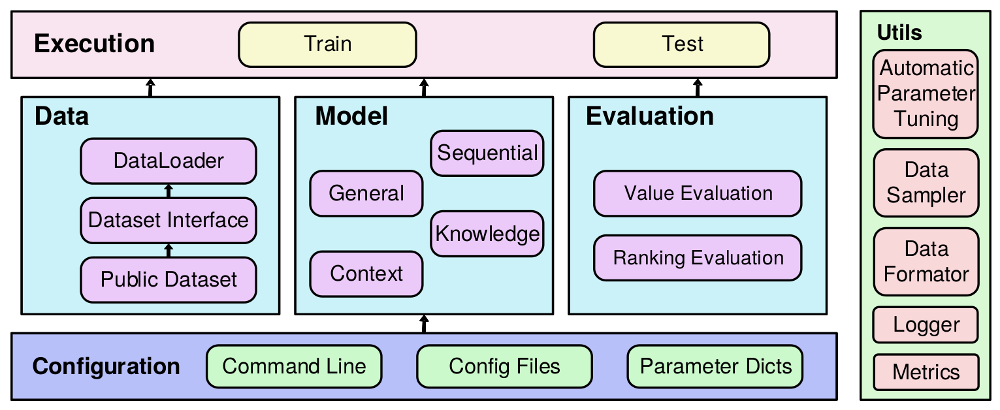

# MKACR on RecBole

This repository contains the official implementation for the paper **"Multi-Space Knowledge Graph Embedding and Adversarial Contrastive Learning for Recommendation"**.

Our model, **MKACR**, is developed based on the comprehensive recommendation library [RecBole](https://github.com/RUCAIBox/RecBole).

[Paper (Link to be added)] | [Code Repository](https://github.com/ydu62203-lang/recbole)

---

## Overview

**MKACR** is a novel knowledge-aware recommendation model that leverages multi-space knowledge graph embeddings and an adversarial contrastive learning strategy. By projecting entities and relations into distinct spaces, our model captures complex semantics within the knowledge graph. The adversarial contrastive learning component ensures that the embeddings are robust and highly discriminative, leading to improved recommendation performance.

<p align="center">
  
  <br>
  <b>Figure</b>: MKACR Framework
</p>

This implementation uses the powerful and flexible RecBole framework, which provides a unified structure for data processing, model training, and evaluation. We have integrated MKACR as a new knowledge-aware recommender and adapted parts of the training process to support its unique adversarial mechanism.

<p align="center">
  
  <br>
  <b>Figure</b>: The Overall Architecture of the RecBole Framework
</p>

## Installation

Our code requires Python 3.7 or later and PyTorch 1.7.0 or later. Please ensure your environment meets these requirements.

### 1. Clone the Repository
Clone this repository which contains the MKACR model and the modified RecBole framework.
```bash
git clone [https://github.com/ydu62203-lang/recbole.git](https://github.com/ydu62203-lang/recbole.git)
cd recbole
```

### 2. Install Dependencies
Install all the required packages, including RecBole in editable mode. This allows you to use the MKACR model seamlessly.
```bash
pip install -e . --verbose
```

## Quick Start: Running MKACR

Our model is built upon the KGAT framework. Running an experiment requires configuring several files and then executing a specific script.

### 1. Configure the Dataset
Open `RecBole-master/ml-1m.yaml` (or your chosen dataset's YAML file) to ensure the data loading paths and parameters are correct.

### 2. Configure Model Hyperparameters
Open `RecBole-master/recbole/properties/model/KGAT.yaml`. This file is used to control the hyperparameters for our MKACR model. You can directly modify parameters like `embedding_size`, `reg_weight`, `context_hops`, etc., in this file.

### 3. Run the Model
Execute the `run_kgat.py` script from the root directory to start training and evaluation. This script is set up to run our MKACR model within the KGAT framework.

```bash
python run_kgat.py
```

The script will use the configurations you set in the YAML files. The training process will begin, and you will see the evaluation results printed in the console.

## Implementation Details

To implement the MKACR model, we performed a deep integration and modification of the KGAT model within the RecBole framework. Running our model requires understanding and configuring the following core files:

* **`run_kgat.py`**: This is the main script for running our experiments. We have modified it to load the MKACR model and its corresponding configurations.
* **`RecBole-master/ml-1m.yaml`**: The configuration file for the dataset. You will need to configure the path and loading parameters for `ml-1m` or other datasets in this file.
* **`RecBole-master/recbole/trainer/trainer.py`**: The core trainer file. We have modified this file to support the model's unique adversarial contrastive learning training process.
* **`RecBole-master/recbole/properties/model/KGAT.yaml`**: The default parameter file for the KGAT model. Our MKACR model reuses this file to define hyperparameters. You can directly modify parameters such as `embedding_size` and `reg_weight` here.
* **`RecBole-master/recbole/model/knowledge_aware_recommender/mkacr.py`**: The main implementation code for the MKACR model. This file implements the core architecture of the model, using KGAT as the foundational framework.

Furthermore, a key innovation of this implementation is the introduction of support for multiple geometric spaces. We have added embedding calculation code files for **Hyperbolic Space**, **Euclidean Space**, and **Complex Space**, which are crucial for achieving multi-space knowledge graph embeddings.

## Cite

If you find our work useful for your research, please consider citing our paper.
```bibtex
@article{2026-mkacr,
  author  = {Qianying Wang and Shanyun Du and Meng Zhang},
  title   = {Multi-Space Knowledge Graph Embedding and Adversarial Contrastive Learning for Recommendation},
  journal = {Pattern Recognition},
  year    = {2026}
}
```

Please also cite the original **RecBole** papers, as our work is built upon their excellent library.
```bibtex
@inproceedings{recbole[1.0],
  author    = {Wayne Xin Zhao and Shanlei Mu and Yupeng Hou and Zihan Lin and Yushuo Chen and Xingyu Pan and Kaiyuan Li and Yujie Lu and Hui Wang and Changxin Tian and Yingqian Min and Zhichao Feng and Xinyan Fan and Xu Chen and Pengfei Wang and Wendi Ji and Yaliang Li and Xiaoling Wang and Ji{-}Rong Wen},
  title     = {RecBole: Towards a Unified, Comprehensive and Efficient Framework for Recommendation Algorithms},
  booktitle = {{CIKM}},
  pages     = {4653--4664},
  publisher = {{ACM}},
  year      = {2021}
}

@inproceedings{recbole[2.0],
  author    = {Wayne Xin Zhao and Yupeng Hou and Xingyu Pan and Chen Yang and Zeyu Zhang and Zihan Lin and Jingsen Zhang and Shuqing Bian and Jiakai Tang and Wenqi Sun and Yushuo Chen and Lanling Xu and Gaowei Zhang and Zhen Tian and Changxin Tian and Shanlei Mu and Xinyan Fan and Xu Chen and Ji{-}Rong Wen},
  title     = {RecBole 2.0: Towards a More Up-to-Date Recommendation Library},
  booktitle = {{CIKM}},
  pages     = {4722--4726},
  publisher = {{ACM}},
  year      = {2022}
}
```

## License
This project is licensed under the [MIT License](./LICENSE).

## Acknowledgments
This project would not be possible without the foundational work of the [RecBole Team](https://recbole.io/about.html). We sincerely thank them for developing and maintaining this comprehensive library.
